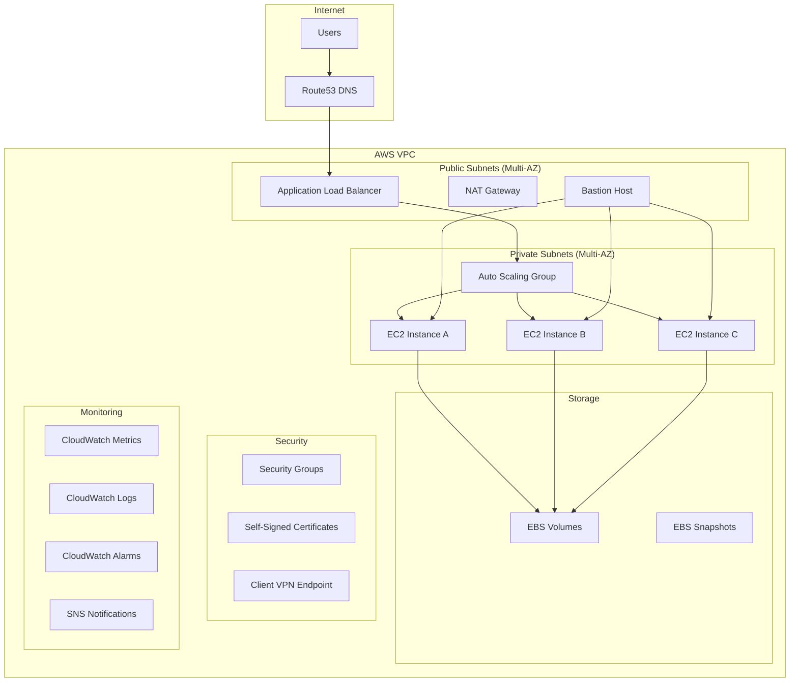

# EC2-Ready Solution Design Document

## Overview

The EC2-Ready Solution is a comprehensive, modular AWS infrastructure template built with Terraform that provides a production-ready foundation for deploying applications on Amazon EC2. The system follows a modular architecture pattern where each AWS service is encapsulated in its own Terraform module, allowing users to selectively deploy components based on their specific requirements.

The solution builds upon the existing infrastructure foundation and extends it with additional modules for load balancing, auto-scaling, enhanced monitoring, storage management, and improved security controls. The design emphasizes reusability, maintainability, and adherence to AWS best practices.

## Architecture

### High-Level Architecture



### Module Architecture

The solution follows a modular architecture with the following core modules:

1. **VPC Module** - Network foundation and connectivity
2. **EC2 Module** - Compute instances and auto-scaling
3. **ALB Module** - Application load balancing and traffic distribution
4. **Security Module** - Security groups and access controls
5. **Storage Module** - EBS volumes and snapshot management
6. **Certificate Module** - Self-signed certificate generation and management
7. **Route53 Module** - DNS management and domain configuration
8. **Monitoring Module** - CloudWatch metrics, logs, and alerting
9. **VPN Module** - Client VPN endpoint for secure access

## Components and Interfaces

### 1. VPC Module (Enhanced)

**Purpose**: Provides the foundational network infrastructure with multi-AZ support.

**Components**:
- VPC with configurable CIDR blocks
- Public subnets across multiple availability zones
- Private subnets across multiple availability zones
- Internet Gateway for public subnet connectivity
- NAT Gateways for private subnet outbound access
- Route tables and routing configuration
- VPC Flow Logs for network monitoring

**Interfaces**:
```hcl
# Inputs
variable "vpc_cidr_block" { type = string }
variable "availability_zones" { type = list(string) }
variable "public_subnet_cidrs" { type = list(string) }
variable "private_subnet_cidrs" { type = list(string) }
variable "enable_flow_logs" { type = bool }

# Outputs
output "vpc_id" { value = aws_vpc.main.id }
output "public_subnet_ids" { value = aws_subnet.public[*].id }
output "private_subnet_ids" { value = aws_subnet.private[*].id }
output "nat_gateway_ids" { value = aws_nat_gateway.main[*].id }
```

### 2. EC2 Module (Enhanced)

**Purpose**: Manages EC2 instances with auto-scaling capabilities and enhanced security.

**Components**:
- Launch templates with configurable instance types
- Auto Scaling Groups with multi-AZ deployment
- Instance profiles and IAM roles
- User data scripts for instance initialization
- EBS-optimized instances with encryption
- CloudWatch agent installation for enhanced monitoring

**Interfaces**:
```hcl
# Inputs
variable "instance_types" { type = list(string) }
variable "min_size" { type = number }
variable "max_size" { type = number }
variable "desired_capacity" { type = number }
variable "subnet_ids" { type = list(string) }
variable "security_group_ids" { type = list(string) }
variable "enable_monitoring" { type = bool }

# Outputs
output "auto_scaling_group_arn" { value = aws_autoscaling_group.main.arn }
output "launch_template_id" { value = aws_launch_template.main.id }
output "instance_profile_arn" { value = aws_iam_instance_profile.main.arn }
```

### 3. ALB Module (New)

**Purpose**: Provides application load balancing with SSL termination and health checks.

**Components**:
- Application Load Balancer with multi-AZ deployment
- Target groups with health check configuration
- SSL/TLS listeners using self-signed certificates
- Security groups for load balancer access
- Access logs configuration

**Interfaces**:
```hcl
# Inputs
variable "vpc_id" { type = string }
variable "subnet_ids" { type = list(string) }
variable "certificate_arn" { type = string }
variable "target_group_port" { type = number }
variable "health_check_path" { type = string }

# Outputs
output "load_balancer_arn" { value = aws_lb.main.arn }
output "load_balancer_dns_name" { value = aws_lb.main.dns_name }
output "target_group_arn" { value = aws_lb_target_group.main.arn }
```

### 4. Security Module (Enhanced)

**Purpose**: Manages security groups and network access controls with least-privilege principles.

**Components**:
- Security groups for different tiers (web, app, database)
- Bastion host security group with restricted access
- Load balancer security group with public access
- VPN security group for client VPN access
- Security group rules with source/destination restrictions

**Interfaces**:
```hcl
# Inputs
variable "vpc_id" { type = string }
variable "allowed_cidr_blocks" { type = list(string) }
variable "ssh_allowed_ips" { type = list(string) }
variable "enable_bastion" { type = bool }

# Outputs
output "web_security_group_id" { value = aws_security_group.web.id }
output "app_security_group_id" { value = aws_security_group.app.id }
output "bastion_security_group_id" { value = aws_security_group.bastion.id }
```

### 5. Storage Module (New)

**Purpose**: Manages EBS volumes, snapshots, and storage lifecycle policies.

**Components**:
- EBS volumes with configurable types and sizes
- Automated snapshot creation and retention
- Volume encryption using AWS KMS
- Lifecycle policies for cost optimization
- Cross-AZ snapshot replication

**Interfaces**:
```hcl
# Inputs
variable "volume_size" { type = number }
variable "volume_type" { type = string }
variable "encrypted" { type = bool }
variable "snapshot_retention_days" { type = number }
variable "availability_zones" { type = list(string) }

# Outputs
output "volume_ids" { value = aws_ebs_volume.main[*].id }
output "snapshot_policy_arn" { value = aws_dlm_lifecycle_policy.main.arn }
```

### 6. Certificate Module (Enhanced)

**Purpose**: Generates and manages self-signed SSL/TLS certificates for secure communications.

**Components**:
- Self-signed CA certificate generation
- Server certificates for load balancer SSL termination
- Client certificates for VPN authentication
- Certificate rotation automation
- Certificate storage in AWS Systems Manager Parameter Store

**Interfaces**:
```hcl
# Inputs
variable "domain_name" { type = string }
variable "organization" { type = string }
variable "country" { type = string }
variable "certificate_validity_days" { type = number }

# Outputs
output "ca_certificate_arn" { value = aws_acm_certificate.ca.arn }
output "server_certificate_arn" { value = aws_acm_certificate.server.arn }
output "client_certificate_arn" { value = aws_acm_certificate.client.arn }
```

### 7. Route53 Module (Enhanced)

**Purpose**: Manages DNS configuration and domain routing.

**Components**:
- Hosted zones for domain management
- A records pointing to load balancer
- Health checks for DNS failover
- Alias records for AWS resource integration
- DNS query logging

**Interfaces**:
```hcl
# Inputs
variable "domain_name" { type = string }
variable "load_balancer_dns_name" { type = string }
variable "load_balancer_zone_id" { type = string }
variable "enable_health_checks" { type = bool }

# Outputs
output "hosted_zone_id" { value = aws_route53_zone.main.zone_id }
output "name_servers" { value = aws_route53_zone.main.name_servers }
```

### 8. Monitoring Module (New)

**Purpose**: Provides comprehensive monitoring, logging, and alerting capabilities.

**Components**:
- CloudWatch metrics for all AWS resources
- Custom metrics from EC2 instances
- CloudWatch Logs for application and system logs
- CloudWatch Alarms with configurable thresholds
- SNS topics for alert notifications
- CloudWatch Dashboards for visualization
- Log metric filters for custom alerting

**Interfaces**:
```hcl
# Inputs
variable "notification_email" { type = string }
variable "alarm_thresholds" { type = map(number) }
variable "log_retention_days" { type = number }
variable "enable_detailed_monitoring" { type = bool }

# Outputs
output "sns_topic_arn" { value = aws_sns_topic.alerts.arn }
output "dashboard_url" { value = aws_cloudwatch_dashboard.main.dashboard_url }
output "log_group_names" { value = aws_cloudwatch_log_group.main[*].name }
```

### 9. VPN Module (Enhanced)

**Purpose**: Provides secure remote access to private resources via Client VPN.

**Components**:
- Client VPN endpoint with certificate authentication
- VPN network associations with private subnets
- Authorization rules for VPC access
- Connection logging to CloudWatch
- Client configuration generation

**Interfaces**:
```hcl
# Inputs
variable "client_cidr_block" { type = string }
variable "server_certificate_arn" { type = string }
variable "client_certificate_arn" { type = string }
variable "subnet_ids" { type = list(string) }
variable "vpc_cidr_block" { type = string }

# Outputs
output "vpn_endpoint_id" { value = aws_ec2_client_vpn_endpoint.main.id }
output "vpn_endpoint_dns_name" { value = aws_ec2_client_vpn_endpoint.main.dns_name }
```

## Data Models

### Configuration Data Model

```hcl
# Main configuration structure
variable "ec2_solution_config" {
  type = object({
    # Environment configuration
    environment = object({
      name   = string
      prefix = string
      region = string
      tags   = map(string)
    })
    
    # Network configuration
    network = object({
      vpc_cidr             = string
      availability_zones   = list(string)
      public_subnet_cidrs  = list(string)
      private_subnet_cidrs = list(string)
      enable_flow_logs     = bool
    })
    
    # Compute configuration
    compute = object({
      instance_types    = list(string)
      min_size         = number
      max_size         = number
      desired_capacity = number
      enable_monitoring = bool
      user_data_script = string
    })
    
    # Load balancer configuration
    load_balancer = object({
      enable           = bool
      target_port      = number
      health_check_path = string
      ssl_policy       = string
    })
    
    # Storage configuration
    storage = object({
      volume_size              = number
      volume_type              = string
      encrypted                = bool
      snapshot_retention_days  = number
      enable_lifecycle_policy  = bool
    })
    
    # Security configuration
    security = object({
      allowed_cidr_blocks = list(string)
      ssh_allowed_ips     = list(string)
      enable_bastion      = bool
      enable_vpn          = bool
    })
    
    # DNS configuration
    dns = object({
      domain_name          = string
      enable_health_checks = bool
      ttl                  = number
    })
    
    # Monitoring configuration
    monitoring = object({
      notification_email       = string
      log_retention_days      = number
      enable_detailed_monitoring = bool
      alarm_thresholds        = map(number)
    })
    
    # Certificate configuration
    certificates = object({
      organization           = string
      country               = string
      validity_days         = number
      enable_auto_rotation  = bool
    })
  })
}
```

## Error Handling

### 1. Resource Creation Failures

**Strategy**: Implement comprehensive error handling with automatic rollback capabilities.

- Use Terraform's built-in dependency management and error propagation
- Implement pre-condition checks for resource requirements
- Provide detailed error messages with remediation guidance
- Use lifecycle rules to prevent accidental resource destruction

### 2. Network Connectivity Issues

**Strategy**: Implement network validation and health checks.

- Validate CIDR block conflicts before VPC creation
- Implement connectivity tests between subnets
- Monitor NAT Gateway health and implement automatic failover
- Validate security group rules for proper access

### 3. Certificate Management Errors

**Strategy**: Implement robust certificate lifecycle management.

- Validate certificate parameters before generation
- Implement certificate expiration monitoring
- Provide automatic certificate rotation capabilities
- Store certificates securely in AWS Systems Manager

### 4. Auto Scaling Failures

**Strategy**: Implement comprehensive instance health monitoring.

- Configure detailed health checks for EC2 instances
- Implement automatic instance replacement for failed instances
- Monitor Auto Scaling Group metrics and adjust policies
- Provide manual scaling override capabilities

### 5. Monitoring and Alerting Failures

**Strategy**: Implement redundant monitoring and notification systems.

- Use multiple SNS topics for critical alerts
- Implement CloudWatch alarm redundancy
- Monitor monitoring system health
- Provide fallback notification mechanisms

## Testing Strategy

### 1. Unit Testing

**Scope**: Individual Terraform modules and their configurations.

**Approach**:
- Use Terratest for automated Terraform testing
- Test module input validation and output generation
- Validate resource creation and configuration
- Test module interdependencies and data flow

**Test Cases**:
- VPC module creates correct network topology
- EC2 module launches instances with proper configuration
- Security groups implement least-privilege access
- Load balancer properly distributes traffic
- Monitoring creates appropriate alarms and dashboards

### 2. Integration Testing

**Scope**: End-to-end functionality across multiple modules.

**Approach**:
- Deploy complete infrastructure in test environment
- Validate inter-module communication and data flow
- Test failover and disaster recovery scenarios
- Validate security controls and access restrictions

**Test Cases**:
- Complete infrastructure deployment and teardown
- Load balancer health checks and traffic routing
- Auto Scaling Group scaling policies and instance replacement
- VPN connectivity and access controls
- Certificate generation and SSL termination

### 3. Security Testing

**Scope**: Security controls and compliance validation.

**Approach**:
- Use AWS Config rules for compliance checking
- Implement security scanning with tools like Checkov
- Validate network segmentation and access controls
- Test certificate security and encryption

**Test Cases**:
- Security group rules prevent unauthorized access
- EBS volumes are properly encrypted
- VPN access is restricted to authorized users
- SSL/TLS certificates are properly configured
- Network traffic is properly segmented

### 4. Performance Testing

**Scope**: System performance and scalability validation.

**Approach**:
- Load testing of application infrastructure
- Auto Scaling Group performance validation
- Network throughput and latency testing
- Storage performance validation

**Test Cases**:
- Load balancer handles expected traffic volumes
- Auto Scaling Group responds to load changes
- Network performance meets requirements
- Storage IOPS and throughput meet specifications

### 5. Disaster Recovery Testing

**Scope**: Backup, recovery, and failover capabilities.

**Approach**:
- Test EBS snapshot creation and restoration
- Validate multi-AZ failover capabilities
- Test infrastructure recreation from Terraform state
- Validate monitoring and alerting during failures

**Test Cases**:
- EBS snapshots can restore data successfully
- Multi-AZ deployment survives AZ failures
- Infrastructure can be recreated in different regions
- Monitoring systems detect and alert on failures